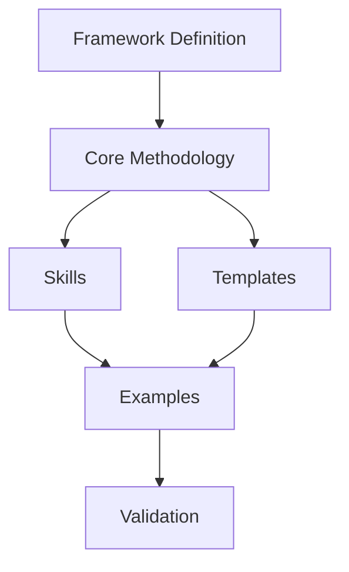

# 02 Framework Blueprint

> CSE Meta Framework — Framework Blueprint

Version: 1.0.0  
Status: Draft  
Owner: CSE  
Category: Core Design  
Source of Truth: Framework Blueprint  
Last Updated: 2026-07-11

Depends On:
- `00-philosophy.md`
- `01-framework-lifecycle.md`
- `03-design-principles.md`
- `14-glossary.md`

Required By:
- `04-repository-architecture.md`
- `06-core-methodology.md`

---

# Purpose

本文件定義每一個 CSE Framework 在進入正式開發前，必須完成的標準設計藍圖。

Framework Blueprint 的目的不是描述 Repository 長什麼樣，而是確認：

- Framework 為什麼存在
- Framework 要解決什麼問題
- Framework 的邊界在哪裡
- Framework 如何運作
- Framework 需要哪些組件
- Framework 如何被驗證
- Framework 如何被發布與持續演進

Blueprint 是 Define 與 Design 階段之間的主要橋樑。

任何 CSE Framework 在大量建立文件、Skill、Template、Example 或 Config 之前，都必須先完成 Blueprint。

---

# 1. Blueprint Position in the Lifecycle

Framework Blueprint 位於 CSE Framework Lifecycle 的 Define 與 Design 階段之間。

```text
Discover
   ↓
Define
   ↓
Framework Blueprint
   ↓
Design
   ↓
Develop
   ↓
Validate
   ↓
Release
   ↓
Evolve
```

Blueprint 的功能是把抽象的 Framework Definition 轉換成可執行的 Framework 設計。

---

# 2. Blueprint Core Structure

每一個 Framework Blueprint 必須包含以下十二個區塊：

| Section | Purpose |
|---|---|
| 1. Identity | 定義 Framework 身份 |
| 2. Problem | 定義要解決的核心問題 |
| 3. Users | 定義目標使用者 |
| 4. Scope | 定義責任範圍 |
| 5. Non-Goals | 定義明確不做的事情 |
| 6. Value | 定義 Framework 的價值 |
| 7. Methodology | 定義核心方法論 |
| 8. Architecture | 定義主要組件與關係 |
| 9. Inputs and Outputs | 定義資料流 |
| 10. Validation | 定義驗證方式 |
| 11. Governance | 定義維護與決策規則 |
| 12. Release | 定義完成與發布條件 |

---

# 3. Section 1 — Framework Identity

## 3.1 Required Fields

每個 Framework 必須定義：

```yaml
name:
repository_name:
short_name:
version:
status:
owner:
category:
license:
```

## 3.2 Naming Rules

Framework 名稱必須：

- 簡單
- 專業
- 可辨識
- 不與既有 Framework 重疊
- 不依賴單一模型或供應商
- 能反映唯一核心責任

Repository 命名格式：

```text
CSE-<Framework-Name>
```

例如：

```text
CSE-TaskRouter
CSE-Prompt-Engineering
CSE-Context-Engineering
CSE-Agent-Framework
```

## 3.3 Identity Checklist

- [ ] 名稱能在 10 秒內理解
- [ ] 名稱與功能一致
- [ ] Repository 名稱符合 CSE 規範
- [ ] Short Name 沒有歧義
- [ ] License 已確認
- [ ] Owner 已確認

---

# 4. Section 2 — Problem Definition

## 4.1 Problem Statement

問題敘述必須符合以下格式：

```text
目前的使用者／組織在進行 ______ 時，
因為 ______，
導致 ______。
本 Framework 透過 ______ 解決此問題。
```

## 4.2 Required Problem Elements

每個 Problem Definition 必須包含：

- Current Situation
- Pain Point
- Root Cause
- Impact
- Existing Alternatives
- Gap
- Framework Necessity

## 4.3 Problem Quality Rules

問題必須：

- 真實存在
- 可重複發生
- 不是單一案例
- 不可只靠一個 Prompt 解決
- 不可只是跟隨熱門工具
- 能被 Framework 形式處理

## 4.4 Problem Checklist

- [ ] 問題不是一次性需求
- [ ] 問題有明確使用者
- [ ] 問題具有可重複性
- [ ] 現有方案不足
- [ ] 建立 Framework 合理
- [ ] 問題可被驗證

---

# 5. Section 3 — Target Users

## 5.1 User Groups

Framework 必須明確定義主要與次要使用者。

| User Type | Description |
|---|---|
| Primary User | Framework 的主要使用者 |
| Secondary User | 間接使用者 |
| Maintainer | 維護 Framework 的人 |
| Contributor | 提交內容或修正的人 |
| Reviewer | 驗證 Framework 品質的人 |

## 5.2 User Definition Template

```yaml
primary_users:
  - role:
    needs:
    pain_points:
    expected_outcomes:

secondary_users:
  - role:
    needs:
    pain_points:
    expected_outcomes:
```

## 5.3 User Design Rules

不得使用過度寬泛的描述，例如：

```text
所有人
所有企業
所有 AI 使用者
```

應改為具體角色，例如：

```text
AI 講師
企業 AI 導入顧問
開源 Framework 維護者
AI 工程師
知識工作者
```

---

# 6. Section 4 — Scope

## 6.1 Included Scope

Scope 必須描述 Framework 負責的能力與內容。

建議格式：

```markdown
## Included

- Capability A
- Capability B
- Capability C
```

## 6.2 Scope Rules

Included Scope 必須：

- 與 Problem 一致
- 與 Framework 名稱一致
- 可被方法論支持
- 可被驗證
- 可被 Repository 實作

## 6.3 Boundary Rule

每個 Framework 應遵循：

```text
One Framework
One Core Problem
One Primary Methodology
```

若 Framework 同時解決多個核心問題，應拆分成多個 Repository。

---

# 7. Section 5 — Non-Goals

## 7.1 Purpose

Non-Goals 用來防止 Framework 不斷膨脹。

每個 Framework 必須明確列出不負責的內容。

## 7.2 Non-Goal Template

```markdown
## Non-Goals

This Framework does not:

- ...
- ...
- ...
```

## 7.3 Common Non-Goals

常見項目包括：

- 不比較特定模型優劣
- 不提供特定供應商教學
- 不涵蓋其他 Framework 的方法論
- 不取代人工決策
- 不保證所有情境適用
- 不處理未授權資料
- 不執行超出 Scope 的自動化

## 7.4 Boundary Conflict Rule

若某項功能同時屬於兩個 Framework：

1. 指定主要責任 Framework。
2. 其他 Framework 僅建立引用。
3. 不複製完整方法論。
4. 在 Blueprint 中記錄依賴關係。

---

# 8. Section 6 — Value Proposition

## 8.1 Required Values

Framework 必須定義：

- 使用者價值
- 組織價值
- 技術價值
- 維護價值

## 8.2 Value Template

| Value Type | Question |
|---|---|
| User Value | 使用者能更快、更準確完成什麼？ |
| Business Value | 組織能降低什麼成本或風險？ |
| Technical Value | 系統能提升什麼一致性或可維護性？ |
| Governance Value | 如何提升可追蹤、可審核與可治理性？ |

## 8.3 Value Quality Rule

價值不得只寫：

```text
提升效率
提高品質
節省時間
```

必須轉為可驗證結果，例如：

```text
將 Framework 建立時間由數天縮短為數小時。
將 Repository 結構不一致問題降至可控範圍。
使新 Skill 可直接套用標準模板。
```

---

# 9. Section 7 — Core Methodology

## 9.1 Purpose

每個 Framework 只能有一個主要方法論。

方法論必須描述 Framework 如何把輸入轉換成輸出。

## 9.2 Methodology Format

```text
Input
  ↓
Step 1
  ↓
Step 2
  ↓
Step 3
  ↓
Validation
  ↓
Output
```

## 9.3 Required Methodology Elements

- Trigger
- Input
- Stages
- Decision Points
- Constraints
- Validation
- Output
- Feedback Loop

## 9.4 Methodology Rules

核心方法論必須：

- 可重複
- 可教學
- 可測試
- 可視覺化
- 可拆分
- 可與 Skill 對應
- 不依賴單一模型

## 9.5 Methodology Checklist

- [ ] 有明確起點
- [ ] 有明確終點
- [ ] 每一步有目的
- [ ] 有 Decision Point
- [ ] 有 Validation
- [ ] 有錯誤處理
- [ ] 可對應到實際 Artifact

---

# 10. Section 8 — Framework Architecture

## 10.1 Architecture Purpose

Architecture 定義 Framework 的組成與模組關係。

## 10.2 Minimum Components

每個 Framework 至少應考慮：

```text
Core Methodology
Documentation
Skills
Prompts
Templates
Schemas
Configs
Examples
Validation
Governance
```

## 10.3 Architecture Diagram

每個 Framework Blueprint 必須提供一張 Mermaid 架構圖。

範例：



## 10.4 Architecture Rules

- Core 與 Config 分離
- Methodology 與 Example 分離
- Skill 與 Knowledge 分離
- Dynamic Data 與 Stable Principles 分離
- Diagram 原始檔放在 `diagrams/`
- 模組責任不得重疊

---

# 11. Section 9 — Inputs and Outputs

## 11.1 Input Definition

每個 Framework 必須定義：

- Required Inputs
- Optional Inputs
- Input Types
- Input Constraints
- Missing Input Behavior

## 11.2 Output Definition

每個 Framework 必須定義：

- Primary Output
- Supporting Outputs
- Output Format
- Output Validation
- Error Output
- Warning Output

## 11.3 Input / Output Table

| Type | Field | Required | Description |
|---|---|---:|---|
| Input | task | Yes | 使用者任務 |
| Input | context | No | 補充背景 |
| Output | result | Yes | 主要結果 |
| Output | warnings | No | 風險或限制 |

## 11.4 Structured Output Rule

可自動化的 Framework 應優先提供：

- JSON Schema
- YAML Schema
- Markdown Template
- Validation Rules

---

# 12. Section 10 — Validation Design

## 12.1 Purpose

Blueprint 必須在開發前定義「如何驗證」，但不重複建立完整 Validation Standard。

最低應定義：

- Validation Scope
- Required Validation Levels
- Standard / Boundary / Failure Cases
- Acceptance Criteria
- Human Review Requirement
- Release Blocking Conditions

完整驗證規則請依 [Validation Standard](./11-validation-standard.md) 執行。

# 13. Section 11 — Governance

## 13.1 Purpose

Blueprint 必須指出 Framework 的 Owner、Maintainer、Reviewer 與重大變更責任，但不重複定義完整治理流程。

最低應定義：

- Owner
- Maintainer
- Reviewer
- Decision Rights
- Major Change Trigger
- Approval Requirement

完整治理規則請依 [Governance Standard](./12-governance-standard.md) 執行。

# 14. Section 12 — Release Definition

## 14.1 Purpose

Blueprint 必須在開發前定義最低 Release Readiness，但不重複完整 Release Lifecycle。

最低應定義：

- Required Release Artifacts
- Minimum Validation Result
- Versioning Requirement
- Migration Requirement
- Rollback Requirement
- Owner Approval

完整發布規則請依 [Release Standard](./10-release-standard.md) 執行。

# 15. Blueprint Document Template

每個 Framework 的 Blueprint 可使用以下結構：

```markdown
# Framework Blueprint

## 1. Identity

## 2. Problem Definition

## 3. Target Users

## 4. Scope

## 5. Non-Goals

## 6. Value Proposition

## 7. Core Methodology

## 8. Architecture

## 9. Inputs and Outputs

## 10. Validation Design

## 11. Governance

## 12. Release Definition
```

---

# 16. Blueprint Review Checklist

## Identity

- [ ] Name 清楚
- [ ] Repository 名稱正確
- [ ] Owner 明確

## Problem

- [ ] 問題真實存在
- [ ] 問題可重複
- [ ] 現有方案不足

## Scope

- [ ] Included 清楚
- [ ] Excluded 清楚
- [ ] Non-Goals 完整
- [ ] 與其他 Framework 邊界清楚

## Methodology

- [ ] 只有一個核心方法論
- [ ] 流程可重複
- [ ] 有 Decision Point
- [ ] 有 Validation

## Architecture

- [ ] 模組責任清楚
- [ ] Config 與 Core 分離
- [ ] Skill 與 Knowledge 分離
- [ ] 有 Mermaid 圖

## Validation

- [ ] Acceptance Criteria 已定義
- [ ] Failure Case 已定義
- [ ] Boundary Case 已定義

## Governance

- [ ] Owner 明確
- [ ] 重大變更規則清楚
- [ ] Versioning 規則清楚

---

# 17. Blueprint Stage Gate

只有符合以下條件，Framework 才可正式進入 Design 與 Develop：

- [ ] Identity 完整
- [ ] Problem Definition 通過
- [ ] Target Users 明確
- [ ] Scope 與 Non-Goals 完整
- [ ] Value Proposition 可驗證
- [ ] Core Methodology 已定義
- [ ] Architecture 已建立
- [ ] Inputs and Outputs 已定義
- [ ] Validation Design 已完成
- [ ] Governance 已建立
- [ ] Release Criteria 已建立
- [ ] 與 CSE Philosophy 一致

---

# 18. Immediate Corrections

本版已加入以下固定規則：

1. **Blueprint 不是 Repository 目錄文件**
   - Blueprint 定義 Framework 本身。
   - Repository Architecture 另由後續文件定義。

2. **Blueprint 必須先於大量文件開發**
   - 未通過 Blueprint Stage Gate，不得批次建立大量 Markdown、Skill 或 Template。

3. **每個 Framework 只允許一個主要方法論**
   - 其他流程只能作為子流程，不得與核心方法論競爭。

4. **Validation 必須在 Blueprint 階段先設計**
   - 不得等開發完成後才決定如何驗證。

5. **Non-Goals 與 Scope 同等重要**
   - 未定義 Non-Goals 的 Framework 不得進入 Develop。

---

# 19. Definition of Done

本文件完成代表：

- 已定義所有 CSE Framework 的標準設計藍圖
- 已建立十二個 Blueprint 必要區塊
- 已定義 Blueprint Review Checklist
- 已建立 Blueprint Stage Gate
- 已區分 Blueprint 與 Repository Architecture
- 已建立 Framework 開發前的必要審查規則
- 可供所有後續 CSE Framework 直接套用

---


# Related Documents

- [Philosophy](./00-philosophy.md)
- [Framework Lifecycle](./01-framework-lifecycle.md)
- [Design Principles](./03-design-principles.md)
- [Repository Architecture](./04-repository-architecture.md)
- [Validation Standard](./11-validation-standard.md)
- [Governance Standard](./12-governance-standard.md)
- [Security Standard](./13-security-standard.md)
- [Glossary](./14-glossary.md)

# Next Document

**03-design-principles.md**

下一份文件將重新定義 CSE Meta Framework 的設計原則，並分為：

```text
Foundation Principles
Architecture Principles
Documentation Principles
Quality Principles
Governance Principles
```
