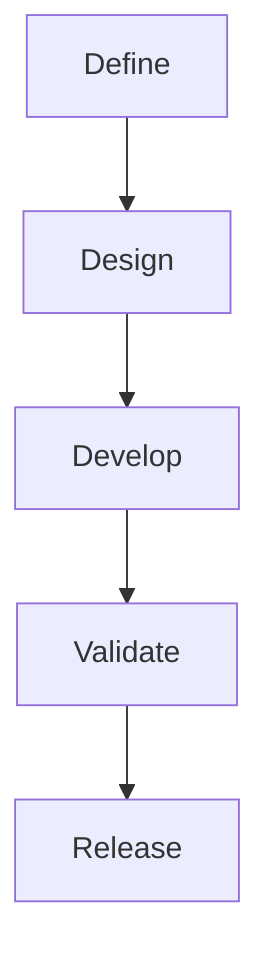

# 05 Document Standards

> CSE Meta Framework — Document Standards

Version: 1.0.0  
Status: Draft  
Owner: CSE  
Category: Documentation Standard  
Source of Truth: Document Standards  
Last Updated: 2026-07-11

Depends On:
- `03-design-principles.md`
- `04-repository-architecture.md`
- `14-glossary.md`

Required By:
- `08-template-standard.md`
- `09-readme-standard.md`
- `14-glossary.md`

---

# Purpose

本文件定義所有 CSE Framework 的文件撰寫、組織、命名、引用與驗證標準。

目標是確保每一份文件都具備：

- 一致性
- 可讀性
- 可維護性
- 可追蹤性
- AI 可理解性
- GitHub 相容性

本文件適用於：

- `README.md`
- `docs/`
- `skills/`
- `prompts/`
- `templates/`
- `examples/`
- `references/`
- `CHANGELOG.md`
- `ROADMAP.md`
- `SECURITY.md`
- 其他 Markdown 文件

---

# 1. Documentation Principles

所有 CSE 文件必須遵循以下原則：

1. **One Document, One Primary Topic**
2. **Single Source of Truth**
3. **Progressive Disclosure**
4. **Stable Methodology, Dynamic Configuration**
5. **Human Readable and AI Readable**
6. **Explicit Structure**
7. **Traceable Changes**
8. **Examples Support Rules, Not Replace Rules**
9. **No Uncontrolled Duplication**
10. **Validation Before Release**

---

# 2. Document Categories

CSE 文件分為七類：

| Category | Purpose | Typical Location |
|---|---|---|
| Governance | 治理、版本、貢獻、安全 | Repository root |
| Core | 哲學、方法論、架構、標準 | `docs/` |
| Operational | Skill、Prompt、執行規則 | `skills/`, `prompts/` |
| Template | 可重複使用模板 | `templates/` |
| Example | 實際案例 | `examples/` |
| Reference | 外部資料與平台說明 | `references/` |
| Decision Record | 重大設計決策 | `docs/decisions/` |

不同類型文件不得互相取代。

例如：

- README 不得取代 Core Documents
- Example 不得取代 Methodology
- Prompt 不得取代 Skill
- Reference 不得取代正式規格

---

# 3. Required Metadata

所有核心文件必須在標題後包含以下 Metadata：

```markdown
Version: 1.0.0
Status: Draft
Owner: CSE
Last Updated: YYYY-MM-DD
```

## 3.1 Required Fields

| Field | Required | Description |
|---|---:|---|
| Version | Yes | 文件版本 |
| Status | Yes | 文件狀態 |
| Owner | Yes | 文件責任人或團隊 |
| Last Updated | Yes | 最後更新日期 |
| Framework | Recommended | 所屬 Framework |
| Reviewers | Optional | 審查人員 |
| Related Documents | Optional | 關聯文件 |

## 3.2 Allowed Status Values

```text
Draft
Alpha
Beta
Release Candidate
Stable
Deprecated
Archived
```

不得自行創造未定義狀態。

---

# 4. File Naming Standard

所有 Markdown 文件使用：

```text
kebab-case.md
```

## 4.1 Ordered Core Documents

核心文件使用兩位數流水號：

```text
00-philosophy.md
01-framework-lifecycle.md
02-framework-blueprint.md
03-design-principles.md
04-repository-architecture.md
05-document-standards.md
```

## 4.2 General Documents

非排序文件：

```text
glossary.md
faq.md
migration-guide.md
```

## 4.3 Decision Records

```text
ADR-001-framework-boundary.md
ADR-002-config-separation.md
```

## 4.4 Prohibited Naming

禁止：

- 空格
- 中文檔名
- 混合 snake_case 與 kebab-case
- 無意義縮寫
- `final.md`
- `new.md`
- `latest.md`
- `copy.md`
- `v2-final-final.md`

版本由 Git 與 Metadata 管理，不寫入檔名。

---

# 5. Heading Standard

Markdown 標題最多使用四層：

```markdown
# Document Title
## Major Section
### Subsection
#### Detail
```

禁止使用五層以上標題。

## 5.1 Heading Rules

- 每份文件只能有一個 `#`
- 章節從 `#` 依序往下
- 不得跳級
- 標題應清楚描述內容
- 標題避免過長
- 同一文件不得重複相同標題

錯誤：

```markdown
# Title
### Details
```

正確：

```markdown
# Title
## Section
### Details
```

---

# 6. Standard Document Structure

核心文件應依下列順序組織：

```text
Title
Metadata
Purpose
Core Concepts
Rules or Architecture
Examples
Checklist
Immediate Corrections
Definition of Done
Next Document
```

依文件性質可調整，但不得省略：

- Purpose
- Core Rules
- Checklist
- Definition of Done

---

# 7. Writing Style

所有文件遵循以下寫作規範：

## 7.1 Sentence Rules

- 一句話表達一個主要觀念
- 避免過長句
- 避免模糊代名詞
- 避免不必要修飾
- 使用主動語態
- 規則使用明確動詞

建議用詞：

```text
must
should
may
must not
```

中文對應：

```text
必須
應
可以
不得
```

## 7.2 Paragraph Rules

- 一段只處理一個主題
- 長段落應拆成條列
- 每段建議不超過 5–7 行
- 不用大段敘事取代結構化規則

## 7.3 Tone

文件語氣應：

- 專業
- 直接
- 中性
- 可執行
- 不誇張

避免：

- 行銷式口號過多
- 未驗證的最高級描述
- 模糊承諾
- 情緒化用語

---

# 8. Terminology Standard

同一概念只能使用一個正式名稱。

## 8.1 Preferred Terms

| Preferred Term | Avoid |
|---|---|
| Framework | 系統、架構、框架混用 |
| Repository | Repo 於正式文件中混用 |
| Skill | Tool、Plugin 混用 |
| Prompt | 指令、咒語等非正式名稱 |
| Validation | Check、Review 未區分 |
| Blueprint | Plan、Spec 混用 |
| Configuration | Setting、Config 混用於正式定義 |
| Provider | Vendor、Platform 未區分 |

## 8.2 Glossary Rule

所有正式術語必須集中管理。

CSE Meta Framework 使用：

```text
docs/14-glossary.md
```

一般子 Framework 使用：

```text
docs/glossary.md
```

兩者皆以各自 Repository 內的 Glossary 作為正式術語的 Single Source of Truth。

新術語加入核心文件前，必須先：

1. 定義名稱
2. 定義用途
3. 定義與既有術語差異
4. 更新 Glossary

---

# 9. Lists

## 9.1 Bullet Lists

適用於：

- 非順序項目
- 特徵
- 條件
- 範圍

格式：

```markdown
- Item A
- Item B
- Item C
```

## 9.2 Numbered Lists

適用於：

- 流程
- 步驟
- 優先順序
- 必須依序執行的動作

格式：

```markdown
1. Step One
2. Step Two
3. Step Three
```

## 9.3 Nesting Limit

清單最多三層。

若超過三層，應改為：

- Table
- Separate Section
- Diagram

---

# 10. Table Standard

表格適用於：

- 比較
- 欄位定義
- 角色責任
- Required / Optional Matrix
- 狀態與規則

## 10.1 Table Rules

- 第一列必須是欄位名稱
- 欄位名稱保持簡短
- 每欄只表達一類資訊
- 不在單一儲存格放長篇內容
- 表格過寬時拆分
- 不使用表格承載完整流程

範例：

```markdown
| Field | Required | Description |
|---|---:|---|
| Version | Yes | 文件版本 |
| Status | Yes | 文件狀態 |
```

---

# 11. Code Block Standard

所有 Code Block 必須標示語言。

正確：

```markdown
```json
{
  "status": "ok"
}
```
```

```markdown
```yaml
version: 1.0.0
```
```

```markdown
```text
Input
  ↓
Output
```
```

禁止：

- 未標示語言
- 在 Code Block 中混入說明文字
- 用 Code Block 取代一般段落

---

# 12. Mermaid Standard

流程圖、架構圖與決策樹優先使用 Mermaid。

## 12.1 Source Rule

Mermaid 原始檔統一放在：

```text
diagrams/
```

例如：

```text
architecture.mmd
workflow.mmd
lifecycle.mmd
```

## 12.2 Mermaid Rules

- 每張圖只表達一個主要關係
- 節點名稱簡短
- 避免超過 20 個主要節點
- 圖與文字規格必須一致
- PNG / SVG 只作展示
- `.mmd` 為唯一可編輯來源

## 12.3 Example



---

# 13. Links and Cross-References

文件引用必須使用相對路徑。

正確：

```markdown
See [Framework Lifecycle](./01-framework-lifecycle.md).
```

跨目錄：

```markdown
See [Skill Standard](../skills/skill.md).
```

## 13.1 Cross-Reference Rules

- 不複製完整內容
- 連結文字必須具描述性
- 避免使用「點這裡」
- 連結目標必須存在
- Rename 後必須更新所有引用

---

# 14. Single Source of Truth

每項核心規則只能有一個主要來源。

例如：

| Topic | Source of Truth |
|---|---|
| Philosophy | `00-philosophy.md` |
| Lifecycle | `01-framework-lifecycle.md` |
| Blueprint | `02-framework-blueprint.md` |
| Design Principles | `03-design-principles.md` |
| Repository Structure | `04-repository-architecture.md` |
| Document Rules | `05-document-standards.md` |

其他文件只能：

- 摘要
- 引用
- 連結

不得重新定義。

---

# 15. Dynamic Information Handling

高變動資訊不得寫入穩定核心文件。

## 15.1 Dynamic Information Includes

- 模型名稱
- 模型版本
- 價格
- API 名稱
- Provider 功能
- 平台限制
- Feature Availability
- Routing Thresholds

## 15.2 Storage Rules

| Information Type | Location |
|---|---|
| Model Registry | `configs/models.yaml` |
| Routing Rules | `configs/routing.yaml` |
| Provider Guide | `references/provider-guides/` |
| Pricing Reference | `references/official/` |
| Feature Flags | `configs/framework.yaml` |

核心文件只描述方法論與規則。

---

# 16. Examples Standard

每個完整 Example 必須包含：

1. Problem
2. Context
3. Input
4. Workflow
5. Output
6. Validation
7. Lessons Learned
8. Limitations

## 16.1 Example Rules

- 不得只有 Prompt
- 不得只有最終答案
- 必須標示使用條件
- 必須標示驗證結果
- 不得以 Example 取代正式規格
- Example 內容應可重現

---

# 17. Decision Record Standard

重大架構決策使用 ADR。

## 17.1 ADR Template

```markdown
# ADR-001 Decision Title

Status: Proposed
Date: YYYY-MM-DD
Owner: CSE

## Context

## Decision

## Alternatives

## Consequences

## Validation

## Related Documents
```

## 17.2 Required ADR Conditions

以下情況必須建立 ADR：

- 修改 Core Methodology
- 修改 Repository Boundary
- 新增主要模組
- 移除核心模組
- 變更 Schema Contract
- 變更 Skill Interface
- 引入重大外部依賴
- 進行 Breaking Change

---

# 18. README Documentation Rule

README 是入口，不是完整手冊。

README 應包含：

- Framework Summary
- Core Value
- Quick Start
- Architecture Overview
- Documentation Links
- Skill Entry
- Examples
- Version
- License

README 不應包含：

- 全部方法論
- 全部案例
- 所有配置細節
- 完整 API Reference
- 大量平台比較

---

# 19. Changelog Standard

CHANGELOG 採用以下分類：

```text
Added
Changed
Deprecated
Removed
Fixed
Security
```

範例：

```markdown
## [1.1.0] - YYYY-MM-DD

### Added
- Added framework blueprint validation checklist.

### Changed
- Updated repository profile definitions.

### Fixed
- Corrected broken relative links.
```

---

# 20. AI Readability Standard

文件必須能讓 AI 快速定位與執行。

## 20.1 AI Readability Requirements

- 標題穩定
- 章節名稱一致
- 規則使用明確動詞
- Input / Output 明確
- Scope 與 Non-Goals 分開
- 不依賴隱含背景
- 不使用模糊指代
- 重要規則放在可定位章節
- 動態資訊有固定來源

## 20.2 AI Parsing Rules

建議：

- 固定章節名稱
- 使用表格定義欄位
- 使用 YAML / JSON 描述契約
- 使用 Checklist 表達驗證
- 使用 Mermaid 表達流程

避免：

- 純敘事文章
- 過多隱喻
- 無結構長文
- 一段包含多個規則

---

# 21. Accessibility and Localization

## 21.1 Accessibility

文件應：

- 不只依賴顏色傳達資訊
- 圖片提供描述
- 標題層級正確
- 表格欄位清楚
- 避免過度使用 Emoji
- 連結文字具有意義

## 21.2 Language

CSE 可提供多語言版本，但必須：

- 指定主要語言版本
- 多語言文件保持同版本
- 重大更新同步
- 不在同一句中隨意切換語言

建議命名：

```text
README.md
README.zh-TW.md
README.en.md
```

---

# 22. Document Lifecycle

文件狀態依序為：

```text
Draft
  ↓
Review
  ↓
Release Candidate
  ↓
Stable
  ↓
Deprecated
  ↓
Archived
```

## 22.1 Review Requirements

核心文件升級為 Stable 前必須：

- 完成內容審查
- 完成連結檢查
- 完成格式檢查
- 完成一致性檢查
- 更新 Metadata
- 更新 CHANGELOG

---

# 23. Documentation Validation

## 23.1 Structural Validation

檢查：

- 檔名
- Metadata
- Heading
- Link
- Code Block
- Table
- Mermaid
- Required Sections

## 23.2 Content Validation

檢查：

- Scope 一致
- 術語一致
- 無重複規則
- 無衝突內容
- Example 與規格一致
- Dynamic Data 已分離

## 23.3 Release Validation

檢查：

- 文件版本一致
- README 連結正確
- CHANGELOG 已更新
- Deprecated 內容已標示
- Migration Notes 已提供

---

# 24. Documentation Quality Checklist

## Metadata

- [ ] Version 已填寫
- [ ] Status 已填寫
- [ ] Owner 已填寫
- [ ] Last Updated 已填寫

## Structure

- [ ] 一份文件一個主題
- [ ] Heading 不跳級
- [ ] 必要章節完整
- [ ] 文件順序合理

## Content

- [ ] Scope 清楚
- [ ] 名詞一致
- [ ] 沒有未控制的重複內容
- [ ] 規則有明確動詞
- [ ] 重要規則有範例

## Technical

- [ ] Code Block 有語言
- [ ] Relative Link 有效
- [ ] Mermaid 原始檔存在
- [ ] 動態資訊已移至 Config 或 Reference
- [ ] Schema 與文件一致

## Quality

- [ ] 可被人快速理解
- [ ] 可被 AI 快速解析
- [ ] Known Limitations 已標示
- [ ] Validation 已完成
- [ ] CHANGELOG 已更新

---

# 25. Anti-Patterns

## 25.1 Mega README

把全部知識放入 README。

修正：

- README 保留入口
- 細節移至 `docs/`

## 25.2 Duplicate Rules

同一規則出現在多份文件。

修正：

- 建立 Single Source of Truth
- 其他文件改用相對引用

## 25.3 Dynamic Data in Core Docs

將模型版本或價格寫入核心方法論。

修正：

- 移至 `configs/` 或 `references/`

## 25.4 Example Without Validation

案例只有輸入與答案。

修正：

- 加入 Workflow、Validation、Limitations

## 25.5 Hidden Assumptions

規則依賴未說明背景。

修正：

- 明確寫出 Preconditions、Inputs、Constraints

## 25.6 Unversioned Documents

文件被修改但 Version 與 CHANGELOG 未更新。

修正：

- 建立版本與 Review Gate

---

# 26. Immediate Corrections

本版已修正舊版 `03-document-standards.md` 的主要問題：

1. **新增文件類型分類**
   - Governance、Core、Operational、Template、Example、Reference、Decision Record。

2. **新增 Single Source of Truth**
   - 明確規定每項核心規則只能有一個主要來源。

3. **新增 Dynamic Information Handling**
   - 將模型、價格、API 與平台功能移出核心文件。

4. **新增 ADR 標準**
   - 重大架構決策需有正式紀錄。

5. **新增 README 與 CHANGELOG 規範**
   - 避免 README 過度膨脹與變更紀錄不清。

6. **新增 AI Readability、Accessibility 與 Localization**
   - 支援 AI 解析、多人協作與多語言維護。

7. **新增文件生命週期與 Validation**
   - 文件不得未經審查直接標示 Stable。

---

# 27. Definition of Done

本文件完成代表：

- 已定義 CSE 文件分類
- 已定義 Metadata、命名與 Heading 規則
- 已定義寫作、術語、表格、Code Block 與 Mermaid 規範
- 已建立 Cross-Reference 與 Single Source of Truth
- 已建立 Dynamic Information Handling
- 已建立 Example、ADR、README 與 CHANGELOG 規範
- 已建立 AI Readability 與 Accessibility 規則
- 已建立 Document Lifecycle 與 Validation
- 已建立完整 Documentation Quality Checklist
- 可作為所有 CSE Repository 的文件標準

---


# Related Documents

- [Design Principles](./03-design-principles.md)
- [Repository Architecture](./04-repository-architecture.md)
- [README Standard](./09-readme-standard.md)
- [Glossary](./14-glossary.md)

# Next Document

**06-core-methodology.md**

下一份文件將重新定義所有 CSE Framework 共用的執行方法：

```text
Understand
   ↓
Analyze
   ↓
Design
   ↓
Execute
   ↓
Validate
   ↓
Improve
```

並明確區分它與 Framework Lifecycle 的用途。
