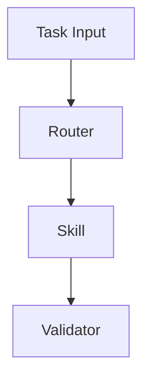

# 09 README Standard

> CSE Meta Framework — README Standard

Version: 1.0.0  
Status: Draft  
Owner: CSE  
Category: Repository Entry Standard  
Source of Truth: README Standard  
Last Updated: 2026-07-11

Depends On:
- `04-repository-architecture.md`
- `05-document-standards.md`
- `14-glossary.md`

Required By:
- `08-template-standard.md`
- `10-release-standard.md`

---

# Purpose

本文件定義所有 CSE Framework Repository 的 `README.md` 標準。

README 的責任是提供 Repository 的清楚入口，讓使用者能快速理解：

- 這個 Framework 是什麼
- 為什麼存在
- 解決什麼問題
- 核心方法論是什麼
- 如何開始使用
- 去哪裡閱讀完整文件
- 目前版本與狀態
- 如何參與與回報問題

README 不應取代完整方法論、Skill 文件、Reference、API 文件或全部案例。

---

# 1. README Role

README 是 Repository 的入口層，不是完整知識庫。

README 的主要任務：

1. 建立第一印象
2. 說明 Framework 核心價值
3. 提供 Quick Start
4. 提供文件導航
5. 提供版本與狀態資訊
6. 提供使用者下一步

README 應在使用者 3 分鐘內回答：

- What
- Why
- Who
- How
- Where Next

---

# 2. README Boundaries

## 2.1 README Should Include

- Framework Name
- Tagline
- Status / Version
- Overview
- Problem
- Value Proposition
- Core Methodology Summary
- Architecture Summary
- Quick Start
- Skill Entry
- Examples Index
- Documentation Index
- Contribution Entry
- License

## 2.2 README Should Not Include

- 完整方法論
- 所有案例
- 全部 Prompt
- 全部 Skill 內容
- 動態模型版本清單
- 價格比較
- 大量 Provider 教學
- 完整 API Reference
- 過長變更紀錄
- 未經驗證的宣傳文字

---

# 2.3 Example Path Convention

本文件中的 `./docs/00-framework-definition.md`、`./docs/03-core-methodology.md` 等路徑，均為**子 Framework Repository 的示意路徑**，不是 CSE Meta Framework 目前核心文件的實際路徑。

CSE Meta Framework 的實際核心文件使用：

```text
./docs/00-philosophy.md
./docs/01-framework-lifecycle.md
./docs/02-framework-blueprint.md
...
./docs/14-glossary.md
./docs/15-roadmap.md
```

範例路徑不得直接視為目前 Repository 的正式 Cross-Reference。

---

# 3. Standard README Structure

所有 Standard 與 Enterprise Profile Repository 應依下列順序：

```text
Title
Tagline
Badges
Overview
Why This Framework
Core Methodology
Architecture
Quick Start
Skills
Examples
Documentation
Repository Structure
Version and Status
Contributing
Security
Roadmap
License
Acknowledgements
```

小型 Repository 可精簡，但不得省略：

- Overview
- Quick Start
- Documentation
- Version
- License

---

# 4. Title Standard

README 第一行必須是 Repository 正式名稱。

```markdown
# CSE TaskRouter
```

規則：

- 與 Repository 名稱一致
- 不加入不必要標點
- 不使用過長副標題
- 不在標題中加入版本號
- 不使用誇張性用語

---

# 5. Tagline Standard

Tagline 用一句話說明 Framework 核心價值。

範例：

```markdown
> Route AI tasks by complexity before selecting a model.
```

Tagline 應：

- 簡短
- 明確
- 可理解
- 不誇張
- 不包含過時產品名稱

避免：

```text
The world's most powerful AI framework.
```

---

# 6. Badge Standard

Badge 用於顯示狀態，不應成為裝飾。

建議 Badge：

- Version
- Status
- License
- Documentation
- Tests
- Build
- Language

範例：

```markdown


```

規則：

- Badge 必須與實際狀態一致
- 不顯示無法驗證的 Badge
- 不使用過多 Badge
- 建議不超過 6 個

---

# 7. Overview Standard

Overview 應在 100–250 字內回答：

- Framework 是什麼
- 解決什麼問題
- 適合誰
- 核心方法是什麼

建議格式：

```markdown
## Overview

CSE TaskRouter is a vendor-neutral framework for classifying AI tasks by complexity and selecting an appropriate execution path. It is designed for AI practitioners, educators, consultants, and enterprise teams that need consistent model and workflow routing.
```

避免：

- 過長歷史背景
- 大量行銷文案
- 模糊描述
- 未定義的術語

---

# 8. Why This Framework

本章說明存在理由。

建議包含：

- Current Problem
- Existing Gap
- Framework Response

範例結構：

```markdown
## Why This Framework

Most teams select AI models by habit or brand preference. This leads to unnecessary cost, latency, and inconsistent quality.

This Framework introduces a task-first routing method based on complexity, risk, scope, and validation needs.
```

---

# 9. Core Methodology Summary

README 只提供摘要，不放完整方法論。

範例：

```markdown
## Core Methodology

```text
Task
  ↓
Complexity
  ↓
Routing
  ↓
Execution
  ↓
Validation
```
```

並連結至完整文件：

```markdown
See [Core Methodology](./docs/03-core-methodology.md).
```

---

# 10. Architecture Summary

Architecture 應提供：

- 一張簡化架構圖
- 主要模組
- 文件連結

範例：



README 不應放超過一張大型架構圖。

完整圖表應移至 `diagrams/` 或 `docs/`。

---

# 11. Quick Start Standard

Quick Start 是 README 最重要的實作章節。

它必須讓新使用者在最短時間內完成第一個有效操作。

應包含：

1. Preconditions
2. Installation or Setup
3. Minimal Example
4. Expected Output
5. Next Step

範例：

```markdown
## Quick Start

### 1. Clone the Repository

```bash
git clone https://github.com/ORG/REPOSITORY.git
```

### 2. Open the Main Skill

```text
skills/task-router/skill.md
```

### 3. Provide a Task

```text
Classify this task and recommend an execution path:
Create a 20-page enterprise AI training deck.
```

### 4. Review the Output

Expected fields:

- task_level
- complexity_score
- recommended_workflow
```

規則：

- 不超過 5–7 步
- 不依賴隱含環境
- 必須有預期結果
- 所有指令應可執行
- 不放未驗證命令

---

# 12. Skills Section

Skills 章節應列出主要 Skill。

範例：

| Skill | Purpose | Status |
|---|---|---|
| Task Router | Classify task complexity | Stable |
| Output Validator | Validate structured output | Beta |

每個 Skill 應連結至對應檔案。

避免在 README 複製完整 Skill。

---

# 13. Examples Section

README 只提供案例索引。

範例：

```markdown
## Examples

- [Beginner Example](./examples/beginner/basic.md)
- [Advanced Example](./examples/advanced/system-design.md)
- [Enterprise Example](./examples/enterprise/ai-transformation.md)
```

不應將完整案例直接放入 README。

---

# 14. Documentation Navigation

Documentation 章節應成為主要導航入口。

建議格式：

| Document | Example Path | Description |
|---|---|---|
| Framework Definition | `./docs/00-framework-definition.md` | Purpose, scope, and boundary |
| Architecture | `./docs/02-architecture.md` | Components and relationships |
| Core Methodology | `./docs/03-core-methodology.md` | Main execution method |
| Validation | `./docs/05-validation.md` | Quality and test rules |

文件索引需：

- 連結有效
- 描述清楚
- 排序一致
- 不列出無關檔案

---

# 15. Repository Structure Section

README 可提供簡化目錄。

範例：

```text
repository/
├── docs/
├── skills/
├── templates/
├── examples/
├── tests/
└── configs/
```

完整目錄規格應連結至 Repository Architecture 文件。

---

# 16. Version and Status

README 必須顯示：

- Current Version
- Current Status
- Last Updated
- Compatibility（如適用）

範例：

```markdown
## Version and Status

- Version: `1.0.0`
- Status: `Draft`
- Last Updated: `2026-07-11`
```

不得只依賴 Badge 顯示版本。

---

# 17. Contributing Section

README 應提供貢獻入口。

範例：

```markdown
## Contributing

See [CONTRIBUTING.md](./CONTRIBUTING.md) for issue, pull request, testing, and review requirements.
```

不需要在 README 重複完整貢獻規則。

---

# 18. Security Section

若 Repository 包含 Skill、工具、外部整合或資料處理，README 應提供 Security 入口。

```markdown
## Security

Report security issues through [SECURITY.md](./SECURITY.md). Do not disclose sensitive vulnerabilities in public issues.
```

---

# 19. Roadmap Section

Roadmap 章節應簡短。

建議：

```markdown
## Roadmap

See [ROADMAP.md](./ROADMAP.md) for current, next, and later priorities.
```

README 不應複製完整 Roadmap。

---

# 20. License Section

README 必須明確說明 License。

範例：

```markdown
## License

This project is licensed under the [MIT License](./LICENSE).
```

---

# 21. Acknowledgements

Acknowledgements 為選用章節。

可包含：

- Contributors
- Official Standards
- Research Sources
- Supporting Organizations

不得將行銷合作資訊混入技術規格。

---

# 22. README Length Guidelines

建議：

| Profile | Recommended Length |
|---|---:|
| Small | 300–800 words |
| Standard | 800–1,800 words |
| Enterprise | 1,200–2,500 words |

若超過建議範圍，應將細節移至 `docs/`。

---

# 23. README Language and Localization

主要 README：

```text
README.md
```

多語言版本：

```text
README.zh-TW.md
README.en.md
```

規則：

- 指定主要語言版本
- 章節結構保持一致
- 版本資訊同步
- 重大更新同步
- 不讓多語言內容互相衝突

---

# 24. README Links

所有內部連結使用相對路徑。

正確：

```markdown
[Core Methodology](./docs/03-core-methodology.md)
```

錯誤：

```markdown
Click here
```

連結文字必須具描述性。

---

# 25. README Visual Rules

README 可使用：

- 一個 Logo
- 一個 Banner
- 一張架構圖
- 少量 Badge
- 少量截圖

避免：

- 過多裝飾圖片
- 大量 GIF
- 影響讀取速度的素材
- 只有圖片、沒有文字說明
- 以顏色作為唯一資訊來源

圖片需放在：

```text
assets/images/
```

---

# 26. README AI Readability

README 應讓 AI 快速辨識：

- Framework Name
- Purpose
- Scope
- Core Methodology
- Main Skill
- Documentation Entry
- Version
- License

建議使用固定標題。

避免：

- 創意但不明確的章節名稱
- 長篇故事
- 隱含上下文
- 無結構敘事
- 同一概念多種名稱

---

# 27. README Source of Truth

README 不是以下內容的 Source of Truth：

| Topic | Source of Truth |
|---|---|
| Philosophy | `docs/00-philosophy.md` |
| Lifecycle | `docs/01-framework-lifecycle.md` |
| Blueprint | `docs/02-framework-blueprint.md` |
| Architecture | `docs/04-repository-architecture.md` |
| Skills | `docs/07-skills-standard.md` |
| Templates | `docs/08-template-standard.md` |
| Version History | `CHANGELOG.md` |
| Security | `SECURITY.md` |

README 只能摘要並連結。

---

# 28. README Validation

README 發布前至少進行四層驗證。

## 28.1 Structural Validation

檢查：

- Title
- Required Sections
- Version
- License
- Quick Start
- Documentation Links

## 28.2 Link Validation

檢查：

- Relative Links
- Missing Files
- Broken Anchors
- External Links

## 28.3 Content Validation

檢查：

- 與 Framework Scope 一致
- 與 Core Methodology 一致
- 與 Repository 實際結構一致
- 與版本資訊一致
- 無過時動態資料

## 28.4 Usability Validation

由新使用者測試：

- 是否能在 3 分鐘內理解 Framework
- 是否能完成 Quick Start
- 是否能找到完整文件
- 是否知道下一步

---

# 29. README Review Checklist

## Identity

- [ ] 正式名稱正確
- [ ] Tagline 清楚
- [ ] Badge 與實際狀態一致

## Overview

- [ ] 100–250 字內說明 What / Why / Who
- [ ] 沒有誇張宣稱
- [ ] 沒有未定義術語

## Quick Start

- [ ] 步驟可執行
- [ ] 指令已驗證
- [ ] 有預期輸出
- [ ] 不超過必要步驟

## Navigation

- [ ] Skills 連結正確
- [ ] Examples 連結正確
- [ ] Documentation Index 正確
- [ ] Governance 文件連結正確

## Version

- [ ] Version 正確
- [ ] Status 正確
- [ ] Last Updated 正確
- [ ] CHANGELOG 一致

## Quality

- [ ] 長度合理
- [ ] 沒有重複完整方法論
- [ ] 沒有動態資料硬編碼
- [ ] Markdown 可讀
- [ ] Link Validation 通過

---

# 30. Anti-Patterns

## 30.1 Mega README

README 包含全部文件內容。

修正：

- 保留摘要與導航
- 細節移至 `docs/`

## 30.2 Marketing-Only README

只有口號與宣傳，沒有使用方式。

修正：

- 加入 Core Methodology、Quick Start 與 Documentation。

## 30.3 No Quick Start

使用者看完仍不知道如何開始。

修正：

- 建立 5–7 步內可完成的 Quick Start。

## 30.4 Stale README

README 與 Repository 實際內容不同。

修正：

- Release 前執行結構與連結檢查。

## 30.5 Dynamic Model Table in README

README 直接寫死模型版本與價格。

修正：

- 移至 `configs/` 或 `references/`

## 30.6 Screenshot-Only Explanation

用圖片取代文字與連結。

修正：

- 保留文字摘要與可存取結構。

## 30.7 Duplicate Governance

在 README 重寫 CONTRIBUTING、SECURITY 或 ROADMAP。

修正：

- 僅提供摘要與連結。

---

# 31. README Template

```markdown
# {{FRAMEWORK_NAME}}

> {{TAGLINE}}

{{BADGES}}

## Overview

{{OVERVIEW}}

## Why This Framework

{{WHY}}

## Core Methodology

{{METHODOLOGY_SUMMARY}}

See [Core Methodology]({{METHODOLOGY_LINK}}).

## Architecture

{{ARCHITECTURE_SUMMARY}}

## Quick Start

{{QUICK_START}}

## Skills

{{SKILLS_INDEX}}

## Examples

{{EXAMPLES_INDEX}}

## Documentation

{{DOCUMENTATION_INDEX}}

## Repository Structure

{{REPOSITORY_STRUCTURE}}

## Version and Status

- Version: `{{VERSION}}`
- Status: `{{STATUS}}`
- Last Updated: `{{LAST_UPDATED}}`

## Contributing

See [CONTRIBUTING.md](./CONTRIBUTING.md).

## Security

See [SECURITY.md](./SECURITY.md).

## Roadmap

See [ROADMAP.md](./ROADMAP.md).

## License

This project is licensed under the [{{LICENSE}}](./LICENSE).

## Acknowledgements

{{ACKNOWLEDGEMENTS}}
```

---

# 32. Immediate Corrections

本版已建立並修正以下核心要求：

1. **README 定位為入口層**
   - 不再承載全部方法論。

2. **建立固定資訊架構**
   - 從 Title、Overview 到 Quick Start、Docs、License。

3. **Quick Start 成為必要章節**
   - 新使用者必須能快速完成第一個操作。

4. **建立 README Source of Truth 邊界**
   - README 只摘要，不重新定義核心規則。

5. **加入長度與視覺規範**
   - 避免 Mega README 與過度裝飾。

6. **加入 AI Readability 與 Localization**
   - 支援 AI 解析與多語言維護。

7. **加入完整 Validation**
   - 結構、連結、內容與可用性都需驗證。

---

# 33. Definition of Done

本文件完成代表：

- 已定義 CSE README 的責任與邊界
- 已建立 Standard README Structure
- 已建立 Title、Tagline、Badge、Overview 與 Quick Start 規範
- 已建立 Skills、Examples、Documentation 與 Repository Navigation
- 已建立 Version、Contributing、Security、Roadmap 與 License 規範
- 已建立長度、視覺、多語言與 AI Readability 規則
- 已建立 README Validation 與 Review Checklist
- 已建立可直接使用的 README Template
- 可供所有 CSE Framework Repository 建立一致的 GitHub 首頁

---


# Related Documents

- [Repository Architecture](./04-repository-architecture.md)
- [Document Standards](./05-document-standards.md)
- [Template Standard](./08-template-standard.md)
- [Release Standard](./10-release-standard.md)
- [Glossary](./14-glossary.md)

# Next Document

**10-release-standard.md**

下一份文件將定義：

- Release Readiness
- Versioning
- Release Candidate
- Validation Gate
- Release Notes
- Git Tag
- Migration
- Rollback
- Deprecation
- Post-Release Review
